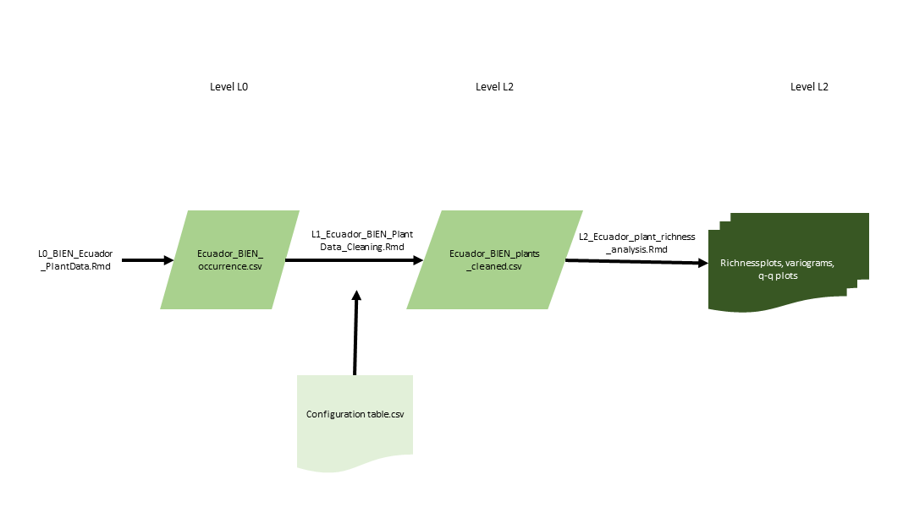

Welcome to my project website for my final project for Fall 2022 Spatial Ecology graduate course at Michigan State University (IBIO 870).

This project follows the [Environmental Data Initative (EDI) workflow](https://environmentaldatainitiative.org/dataset-design/).

1.  [L0_BIEN_Ecuador_PlantData](https://hazeljanderson.github.io/IBIO870_FinalProject/L0_BIEN_Ecuador_PlantData)
2.  [L1_Ecuador_BIEN_PlantData_Cleaning](https://hazeljanderson.github.io/IBIO870_FinalProject/L1_Ecuador_BIEN_PlantData_Cleaning)
3.  [L2_Ecuador_plant_richness_analysis](https://hazeljanderson.github.io/IBIO870_FinalProject/L2_Ecuador_plant_richness_analysis)
